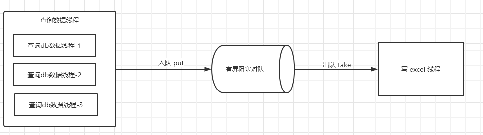

### 功能点
#### Excel 多线程导出
访问路径:http://127.0.0.1:8081/download-excel

#### 通过validator校验数据
- 字段、对象格式的校验
- 自定义注解校验
- 手动调用 validator 校验数据
- 分组校验

#### 统计响应结构
- 全局异常处理
- ResponseBodyAdvice 包装响应结构

#### Excel
- poi excel
- easyExcel
- excel 校验并将excel信息写入excel中
- excel 下载失败返回json信息
- 前端页面post下载excel

#### SPI 
- jdk spi
- spring spi 模仿jdk spi
- spring boot spi

  